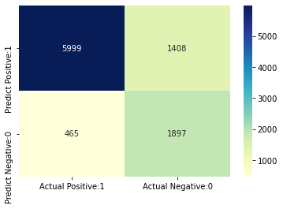
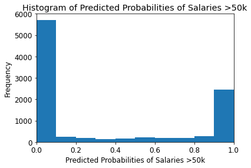
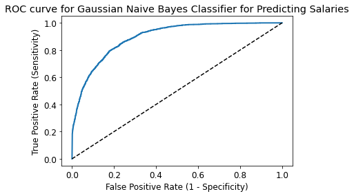

# Naive Bayes Classifier in Python

### Author - Wahid T. Ratul

In this kernel, I implement Naive Bayes Classification algorithm with Python and Scikit-Learn. I build a Naive Bayes Classifier to predict whether a person makes over 50K a year using the Adult Dataset @ https://www.kaggle.com/qizarafzaal/adult-dataset


### Table of Contents


1.	[Introduction to Naive Bayes algorithm](#1)
2.	[Naive Bayes algorithm intuition](#2)
3.	[Types of Naive Bayes algorithm](#3)
4.	[Applications of Naive Bayes algorithm](#4)
5.	[Import libraries](#5)
6.	[Import dataset](#6)
7.	[Exploratory data analysis](#7)
8.	[Declare feature vector and target variable](#8)
9.	[Split data into separate training and test set](#9)
10.	[Feature engineering](#10)
11.	[Feature scaling](#11)
12.	[Model training](#12)
13.	[Predict the results](#13)
14.	[Check accuracy score](#14)
15.	[Confusion matrix](#15)
16.	[Classification metrices](#16)
17.	[Calculate class probabilities](#17)
18.	[ROC - AUC](#18)
19.	[k-Fold Cross Validation](#19)
20.	[Results and conclusion](#20)
21. [References](#21)


### 1. Introduction to Naive Bayes Algorithm
[Table of Contents](#1)

In machine learning, Naïve Bayes classification is a straightforward and powerful algorithm for the classification task. Naïve Bayes classification is based on applying Bayes’ theorem with strong independence assumption between the features. Naïve Bayes classification produces good results when we use it for textual data analysis such as Natural Language Processing.

### 2. Naive Bayes Algorithm Intuition
[Table of Contents](#2)

Naïve Bayes Classifier uses the Bayes’ theorem to predict membership probabilities for each class such as the probability that given record or data point belongs to a particular class. The class with the highest probability is considered as the most likely class. This is also known as the **Maximum Likelihood ratio or Posterior ratio**. 

The **MAP for a hypothesis with 2 events A and B is**

**MAP (A)**

* max (P (A | B))

* max (P (B | A) * P (A))/P (B)

* max (P (B | A) * P (A))


Here, P (B) is evidence probability. It is used to normalize the result. It remains the same, So, removing it would not affect the result.


Naïve Bayes Classifier assumes that all events **A or B** are independent to each other. 


In real world datasets, we test a hypothesis given multiple evidence on features. So, the calculations become quite complicated. To simplify the work, the feature independence approach is used to uncouple multiple evidence and treat each as an independent one.


### 3. Types of Naive Bayes Algorithm

[Table of Contents](#3)

There are 3 types of Naïve Bayes algorithm. The 3 types are listed below:-

  1. Gaussian Naïve Bayes [**Numerical**](1)

  2. Multinomial Naïve Bayes [**Categorical**](2)

  3. Bernoulli Naïve Bayes [**Binomial**](3)

These 3 types of algorithm are explained below.

#### Gaussian Naive Bayes Algorithm

When we have continuous attribute values, we made an assumption that the values associated with each class are distributed according to Gaussian or Normal distribution. For example, suppose the training data contains a continuous attribute x. We first segment the data by the class, and then compute the mean and variance of x in each class. Let µi be the mean of the values and let σi be the variance of the values associated with the ith class. Suppose we have some observation value xi . Then, the probability distribution of xi given a class can be computed by the following equation –


#### Multinomial Naive Bayes Algorithm

With a Multinomial Naïve Bayes model, samples (feature vectors) represent the frequencies with which certain events have been generated by a multinomial
**(p1, . . . ,pn)** where pi is the probability that event i occurs. Multinomial Naïve Bayes algorithm is preferred to use on data that is multinomially distributed. It is one of the standard algorithms which is used in text categorization classification.

####  Bernoulli Naive Bayes Algorithm

In the Multivariate Bernoulli event model, features are independent boolean variables **(binary variables)** describing inputs. Just like the multinomial model, this model is also popular for document classification tasks where binary term occurrence features are used rather than term frequencies.

### 4. Applications of Naive Bayes Algorithm
[Table of Contents](#4)

Naïve Bayes is one of the most straightforward and fast classification algorithm. It is very well suited for large volume of data. It is successfully used in various applications such as :

* Spam filtering
* Text classification
* Sentiment analysis
* Recommender systems

It uses Bayes theorem of probability for prediction of unknown class.

### 5. Import Libraries
[Table of Contents](4)


```python
# Packages
import csv
import numpy as np # linear algebra
import pandas as pd # data processing, CSV file
import matplotlib.pyplot as plt # for data visualization
import seaborn as sns # for statistical data visualization
%matplotlib inline 
```

### 6. Import Dataset
[Table of Contents](6)


```python
data = '/Users/Wahid/Downloads/adult.csv'
df = pd.read_csv(data, header=None, sep=',\s',engine='python')
df.shape
df.head()
```


<div>
<style scoped>
    .dataframe tbody tr th:only-of-type {
        vertical-align: middle;
    }

    .dataframe tbody tr th {
        vertical-align: top;
    }

    .dataframe thead th {
        text-align: right;
    }
</style>
<table border="1" class="dataframe">
  <thead>
    <tr style="text-align: right;">
      <th></th>
      <th>0</th>
      <th>1</th>
      <th>2</th>
      <th>3</th>
      <th>4</th>
      <th>5</th>
      <th>6</th>
      <th>7</th>
      <th>8</th>
      <th>9</th>
      <th>10</th>
      <th>11</th>
      <th>12</th>
      <th>13</th>
      <th>14</th>
    </tr>
  </thead>
  <tbody>
    <tr>
      <th>0</th>
      <td>39</td>
      <td>State-gov</td>
      <td>77516</td>
      <td>Bachelors</td>
      <td>13</td>
      <td>Never-married</td>
      <td>Adm-clerical</td>
      <td>Not-in-family</td>
      <td>White</td>
      <td>Male</td>
      <td>2174</td>
      <td>0</td>
      <td>40</td>
      <td>United-States</td>
      <td>&lt;=50K</td>
    </tr>
    <tr>
      <th>1</th>
      <td>50</td>
      <td>Self-emp-not-inc</td>
      <td>83311</td>
      <td>Bachelors</td>
      <td>13</td>
      <td>Married-civ-spouse</td>
      <td>Exec-managerial</td>
      <td>Husband</td>
      <td>White</td>
      <td>Male</td>
      <td>0</td>
      <td>0</td>
      <td>13</td>
      <td>United-States</td>
      <td>&lt;=50K</td>
    </tr>
    <tr>
      <th>2</th>
      <td>38</td>
      <td>Private</td>
      <td>215646</td>
      <td>HS-grad</td>
      <td>9</td>
      <td>Divorced</td>
      <td>Handlers-cleaners</td>
      <td>Not-in-family</td>
      <td>White</td>
      <td>Male</td>
      <td>0</td>
      <td>0</td>
      <td>40</td>
      <td>United-States</td>
      <td>&lt;=50K</td>
    </tr>
    <tr>
      <th>3</th>
      <td>53</td>
      <td>Private</td>
      <td>234721</td>
      <td>11th</td>
      <td>7</td>
      <td>Married-civ-spouse</td>
      <td>Handlers-cleaners</td>
      <td>Husband</td>
      <td>Black</td>
      <td>Male</td>
      <td>0</td>
      <td>0</td>
      <td>40</td>
      <td>United-States</td>
      <td>&lt;=50K</td>
    </tr>
    <tr>
      <th>4</th>
      <td>28</td>
      <td>Private</td>
      <td>338409</td>
      <td>Bachelors</td>
      <td>13</td>
      <td>Married-civ-spouse</td>
      <td>Prof-specialty</td>
      <td>Wife</td>
      <td>Black</td>
      <td>Female</td>
      <td>0</td>
      <td>0</td>
      <td>40</td>
      <td>Cuba</td>
      <td>&lt;=50K</td>
    </tr>
  </tbody>
</table>
</div>


### 7. Exploratory Data Analysis
[Table of Contents](7)

#### Summary


```python
#Renaming columns 
col_names= ['age','workclass','fnlwgt','education','yrs_of_education','marital_status','occupation','relationship','race','sex','capital_gain','capital_loss','work_hrs_per_week','native_country','income']
df.columns= col_names
df.head()

# Structure of data
df.info()
```

    <class 'pandas.core.frame.DataFrame'>
    RangeIndex: 32561 entries, 0 to 32560
    Data columns (total 15 columns):
     #   Column             Non-Null Count  Dtype 
    ---  ------             --------------  ----- 
     0   age                32561 non-null  int64 
     1   workclass          32561 non-null  object
     2   fnlwgt             32561 non-null  int64 
     3   education          32561 non-null  object
     4   yrs_of_education   32561 non-null  int64 
     5   marital_status     32561 non-null  object
     6   occupation         32561 non-null  object
     7   relationship       32561 non-null  object
     8   race               32561 non-null  object
     9   sex                32561 non-null  object
     10  capital_gain       32561 non-null  int64 
     11  capital_loss       32561 non-null  int64 
     12  work_hrs_per_week  32561 non-null  int64 
     13  native_country     32561 non-null  object
     14  income             32561 non-null  object
    dtypes: int64(6), object(9)
    memory usage: 3.7+ MB


#### Types of variables

I segregate the dataset into categorical and numerical variables. There are a mixture of categorical and numerical variables in the dataset. Categorical variables have data type object. Numerical variables have data type int64.


We can see that there are no missing values in the dataset. I will confirm this further.


#### Summary of Categorical Variables


```python
# Explore categorical variables


# List of categorical variables take binary inputs
categorical = [var for var in df.columns if df[var].dtype=='O']

print('There are {} categorical variables\n'.format(len(categorical)))

print('The categorical variables are :\n\n', categorical)

df[categorical].head()

print('The target variable is :\n', categorical[8])
```

    There are 9 categorical variables
    
    The categorical variables are :
    
     ['workclass', 'education', 'marital_status', 'occupation', 'relationship', 'race', 'sex', 'native_country', 'income']
    The target variable is :
     income


```python
# Checking missing values 

df[categorical].isnull().sum()

```


    workclass         0
    education         0
    marital_status    0
    occupation        0
    relationship      0
    race              0
    sex               0
    native_country    0
    income            0
    dtype: int64


```python
# Frequency counts of categorical variables

for var in categorical:
    print(df[var].value_counts())
```

    Private             22696
    Self-emp-not-inc     2541
    Local-gov            2093
    ?                    1836
    State-gov            1298
    Self-emp-inc         1116
    Federal-gov           960
    Without-pay            14
    Never-worked            7
    Name: workclass, dtype: int64
    HS-grad         10501
    Some-college     7291
    Bachelors        5355
    Masters          1723
    Assoc-voc        1382
    11th             1175
    Assoc-acdm       1067
    10th              933
    7th-8th           646
    Prof-school       576
    9th               514
    12th              433
    Doctorate         413
    5th-6th           333
    1st-4th           168
    Preschool          51
    Name: education, dtype: int64
    Married-civ-spouse       14976
    Never-married            10683
    Divorced                  4443
    Separated                 1025
    Widowed                    993
    Married-spouse-absent      418
    Married-AF-spouse           23
    Name: marital_status, dtype: int64
    Prof-specialty       4140
    Craft-repair         4099
    Exec-managerial      4066
    Adm-clerical         3770
    Sales                3650
    Other-service        3295
    Machine-op-inspct    2002
    ?                    1843
    Transport-moving     1597
    Handlers-cleaners    1370
    Farming-fishing       994
    Tech-support          928
    Protective-serv       649
    Priv-house-serv       149
    Armed-Forces            9
    Name: occupation, dtype: int64
    Husband           13193
    Not-in-family      8305
    Own-child          5068
    Unmarried          3446
    Wife               1568
    Other-relative      981
    Name: relationship, dtype: int64
    White                 27816
    Black                  3124
    Asian-Pac-Islander     1039
    Amer-Indian-Eskimo      311
    Other                   271
    Name: race, dtype: int64
    Male      21790
    Female    10771
    Name: sex, dtype: int64
    United-States                 29170
    Mexico                          643
    ?                               583
    Philippines                     198
    Germany                         137
    Canada                          121
    Puerto-Rico                     114
    El-Salvador                     106
    India                           100
    Cuba                             95
    England                          90
    Jamaica                          81
    South                            80
    China                            75
    Italy                            73
    Dominican-Republic               70
    Vietnam                          67
    Guatemala                        64
    Japan                            62
    Poland                           60
    Columbia                         59
    Taiwan                           51
    Haiti                            44
    Iran                             43
    Portugal                         37
    Nicaragua                        34
    Peru                             31
    France                           29
    Greece                           29
    Ecuador                          28
    Ireland                          24
    Hong                             20
    Cambodia                         19
    Trinadad&Tobago                  19
    Thailand                         18
    Laos                             18
    Yugoslavia                       16
    Outlying-US(Guam-USVI-etc)       14
    Hungary                          13
    Honduras                         13
    Scotland                         12
    Holand-Netherlands                1
    Name: native_country, dtype: int64
    <=50K    24720
    >50K      7841
    Name: income, dtype: int64


```python
# Frequency distribution of categorical variables

for var in categorical:
    print(df[var].value_counts()/np.float(len(df)))
```

    Private             0.697030
    Self-emp-not-inc    0.078038
    Local-gov           0.064279
    ?                   0.056386
    State-gov           0.039864
    Self-emp-inc        0.034274
    Federal-gov         0.029483
    Without-pay         0.000430
    Never-worked        0.000215
    Name: workclass, dtype: float64
    HS-grad         0.322502
    Some-college    0.223918
    Bachelors       0.164461
    Masters         0.052916
    Assoc-voc       0.042443
    11th            0.036086
    Assoc-acdm      0.032769
    10th            0.028654
    7th-8th         0.019840
    Prof-school     0.017690
    9th             0.015786
    12th            0.013298
    Doctorate       0.012684
    5th-6th         0.010227
    1st-4th         0.005160
    Preschool       0.001566
    Name: education, dtype: float64
    Married-civ-spouse       0.459937
    Never-married            0.328092
    Divorced                 0.136452
    Separated                0.031479
    Widowed                  0.030497
    Married-spouse-absent    0.012837
    Married-AF-spouse        0.000706
    Name: marital_status, dtype: float64
    Prof-specialty       0.127146
    Craft-repair         0.125887
    Exec-managerial      0.124873
    Adm-clerical         0.115783
    Sales                0.112097
    Other-service        0.101195
    Machine-op-inspct    0.061485
    ?                    0.056601
    Transport-moving     0.049046
    Handlers-cleaners    0.042075
    Farming-fishing      0.030527
    Tech-support         0.028500
    Protective-serv      0.019932
    Priv-house-serv      0.004576
    Armed-Forces         0.000276
    Name: occupation, dtype: float64
    Husband           0.405178
    Not-in-family     0.255060
    Own-child         0.155646
    Unmarried         0.105832
    Wife              0.048156
    Other-relative    0.030128
    Name: relationship, dtype: float64
    White                 0.854274
    Black                 0.095943
    Asian-Pac-Islander    0.031909
    Amer-Indian-Eskimo    0.009551
    Other                 0.008323
    Name: race, dtype: float64
    Male      0.669205
    Female    0.330795
    Name: sex, dtype: float64
    United-States                 0.895857
    Mexico                        0.019748
    ?                             0.017905
    Philippines                   0.006081
    Germany                       0.004207
    Canada                        0.003716
    Puerto-Rico                   0.003501
    El-Salvador                   0.003255
    India                         0.003071
    Cuba                          0.002918
    England                       0.002764
    Jamaica                       0.002488
    South                         0.002457
    China                         0.002303
    Italy                         0.002242
    Dominican-Republic            0.002150
    Vietnam                       0.002058
    Guatemala                     0.001966
    Japan                         0.001904
    Poland                        0.001843
    Columbia                      0.001812
    Taiwan                        0.001566
    Haiti                         0.001351
    Iran                          0.001321
    Portugal                      0.001136
    Nicaragua                     0.001044
    Peru                          0.000952
    France                        0.000891
    Greece                        0.000891
    Ecuador                       0.000860
    Ireland                       0.000737
    Hong                          0.000614
    Cambodia                      0.000584
    Trinadad&Tobago               0.000584
    Thailand                      0.000553
    Laos                          0.000553
    Yugoslavia                    0.000491
    Outlying-US(Guam-USVI-etc)    0.000430
    Hungary                       0.000399
    Honduras                      0.000399
    Scotland                      0.000369
    Holand-Netherlands            0.000031
    Name: native_country, dtype: float64
    <=50K    0.75919
    >50K     0.24081
    Name: income, dtype: float64


Now, we can see that there are several variables like **workclass, occupation and native_country** which contain missing values. Generally, the missing values are coded as NaN and python will detect them with the usual command of **df.isnull().sum()**.

**I will explore these variables and replace ? with NaN**.


```python
# Explore workclass variables
df.workclass.unique()

```


    array(['State-gov', 'Self-emp-not-inc', 'Private', 'Federal-gov',
           'Local-gov', '?', 'Self-emp-inc', 'Without-pay', 'Never-worked'],
          dtype=object)


```python
# Explore frequency distribution of values in workclass 
df.workclass.value_counts()

# Replace NaN values
df['workclass'].replace('?', np.NaN, inplace=True)

df.workclass.value_counts()

```


    Private             22696
    Self-emp-not-inc     2541
    Local-gov            2093
    State-gov            1298
    Self-emp-inc         1116
    Federal-gov           960
    Without-pay            14
    Never-worked            7
    Name: workclass, dtype: int64


```python
# Explore occupation variable
df.occupation.unique()

```


    array(['Adm-clerical', 'Exec-managerial', 'Handlers-cleaners',
           'Prof-specialty', 'Other-service', 'Sales', 'Craft-repair',
           'Transport-moving', 'Farming-fishing', 'Machine-op-inspct',
           'Tech-support', '?', 'Protective-serv', 'Armed-Forces',
           'Priv-house-serv'], dtype=object)


```python
# Explore frequency distribution of values in occupation
df['occupation'].replace('?', np.NaN, inplace=True)
df.occupation.value_counts()

```


    Prof-specialty       4140
    Craft-repair         4099
    Exec-managerial      4066
    Adm-clerical         3770
    Sales                3650
    Other-service        3295
    Machine-op-inspct    2002
    Transport-moving     1597
    Handlers-cleaners    1370
    Farming-fishing       994
    Tech-support          928
    Protective-serv       649
    Priv-house-serv       149
    Armed-Forces            9
    Name: occupation, dtype: int64


```python
# Explore labels in native_country variable 
df.native_country.unique()

```


    array(['United-States', 'Cuba', 'Jamaica', 'India', '?', 'Mexico',
           'South', 'Puerto-Rico', 'Honduras', 'England', 'Canada', 'Germany',
           'Iran', 'Philippines', 'Italy', 'Poland', 'Columbia', 'Cambodia',
           'Thailand', 'Ecuador', 'Laos', 'Taiwan', 'Haiti', 'Portugal',
           'Dominican-Republic', 'El-Salvador', 'France', 'Guatemala',
           'China', 'Japan', 'Yugoslavia', 'Peru',
           'Outlying-US(Guam-USVI-etc)', 'Scotland', 'Trinadad&Tobago',
           'Greece', 'Nicaragua', 'Vietnam', 'Hong', 'Ireland', 'Hungary',
           'Holand-Netherlands'], dtype=object)


```python
# Explore frequency distribution of values in native_country
df['native_country'].replace('?', np.NaN, inplace=True)
df.native_country.value_counts()

```


    United-States                 29170
    Mexico                          643
    Philippines                     198
    Germany                         137
    Canada                          121
    Puerto-Rico                     114
    El-Salvador                     106
    India                           100
    Cuba                             95
    England                          90
    Jamaica                          81
    South                            80
    China                            75
    Italy                            73
    Dominican-Republic               70
    Vietnam                          67
    Guatemala                        64
    Japan                            62
    Poland                           60
    Columbia                         59
    Taiwan                           51
    Haiti                            44
    Iran                             43
    Portugal                         37
    Nicaragua                        34
    Peru                             31
    France                           29
    Greece                           29
    Ecuador                          28
    Ireland                          24
    Hong                             20
    Cambodia                         19
    Trinadad&Tobago                  19
    Thailand                         18
    Laos                             18
    Yugoslavia                       16
    Outlying-US(Guam-USVI-etc)       14
    Hungary                          13
    Honduras                         13
    Scotland                         12
    Holand-Netherlands                1
    Name: native_country, dtype: int64


```python
# Checking NaN values
df[categorical].isnull().sum()

```


    workclass         1836
    education            0
    marital_status       0
    occupation        1843
    relationship         0
    race                 0
    sex                  0
    native_country     583
    income               0
    dtype: int64


#### Number of labels - Cardinality

The number of labels within a categorical variable is known as **cardinality.** A high number of labels within a variable is known as high cardinality. High cardinality may pose some serious problems in the machine learning model.


```python
# Checking for cardinality in categorical variables
for var in categorical:
    print(var, 'contains', len(df[var].unique()), 'labels')
```

    workclass contains 9 labels
    education contains 16 labels
    marital_status contains 7 labels
    occupation contains 15 labels
    relationship contains 6 labels
    race contains 5 labels
    sex contains 2 labels
    native_country contains 42 labels
    income contains 2 labels


We can see that native_country column contains relatively large number of labels as compared to other columns. I will check for cardinality after train-test split.

#### Summary of Numerical Variables


```python
# Exploring numeric variables
numerical= [var for var in df.columns if df[var].dtype!='O'] #not binary

print('There are {} numerical variables\n'.format(len(numerical)))

print('The numberical variables are:',numerical)
```

    There are 6 numerical variables
    
    The numberical variables are: ['age', 'fnlwgt', 'yrs_of_education', 'capital_gain', 'capital_loss', 'work_hrs_per_week']


```python
# View numerical variables
df[numerical].head()

```


<div>
<style scoped>
    .dataframe tbody tr th:only-of-type {
        vertical-align: middle;
    }

    .dataframe tbody tr th {
        vertical-align: top;
    }

    .dataframe thead th {
        text-align: right;
    }
</style>
<table border="1" class="dataframe">
  <thead>
    <tr style="text-align: right;">
      <th></th>
      <th>age</th>
      <th>fnlwgt</th>
      <th>yrs_of_education</th>
      <th>capital_gain</th>
      <th>capital_loss</th>
      <th>work_hrs_per_week</th>
    </tr>
  </thead>
  <tbody>
    <tr>
      <th>0</th>
      <td>39</td>
      <td>77516</td>
      <td>13</td>
      <td>2174</td>
      <td>0</td>
      <td>40</td>
    </tr>
    <tr>
      <th>1</th>
      <td>50</td>
      <td>83311</td>
      <td>13</td>
      <td>0</td>
      <td>0</td>
      <td>13</td>
    </tr>
    <tr>
      <th>2</th>
      <td>38</td>
      <td>215646</td>
      <td>9</td>
      <td>0</td>
      <td>0</td>
      <td>40</td>
    </tr>
    <tr>
      <th>3</th>
      <td>53</td>
      <td>234721</td>
      <td>7</td>
      <td>0</td>
      <td>0</td>
      <td>40</td>
    </tr>
    <tr>
      <th>4</th>
      <td>28</td>
      <td>338409</td>
      <td>13</td>
      <td>0</td>
      <td>0</td>
      <td>40</td>
    </tr>
  </tbody>
</table>
</div>


```python
# Checking for NaN values in numerical variables
df[numerical].isnull().sum()
```


    age                  0
    fnlwgt               0
    yrs_of_education     0
    capital_gain         0
    capital_loss         0
    work_hrs_per_week    0
    dtype: int64


### 8. Declare feature vector and target variable
[Table of Contents](8)


```python
# X are the independent variables
X= df.drop(['income'],axis=1)

# Y is the response variable
y= df['income']

```

### 9. Split data into training & testing set
[Table of Contents](9)


```python
# Split X & Y into training and testing set
from sklearn.model_selection import train_test_split

X_train, X_test, y_train, y_test= train_test_split(X,y,test_size=0.3, random_state=0)

# Checking the shape of X_train & X_test
X_train.shape, X_test.shape
```


    ((22792, 14), (9769, 14))


### 10. Feature Engineering 
[Table of Contents](10)

**Feature Engineering** is the process of transforming raw data into useful features that help us to understand our model better and increase its predictive power. 


```python
# Checking data types in X_train

X_train.dtypes

# Display categorical variables

categorical= [col for col in X_train.columns if X_train[col].dtype=='O']

categorical
```


    ['workclass',
     'education',
     'marital_status',
     'occupation',
     'relationship',
     'race',
     'sex',
     'native_country']


```python
# Display numerical variables

numerical= [col for col in X_train.columns if X_train[col].dtype !='O']

numerical
```


    ['age',
     'fnlwgt',
     'yrs_of_education',
     'capital_gain',
     'capital_loss',
     'work_hrs_per_week']


```python
# Print percentage of missing values in the categorical variables in training set

X_train[categorical].isnull().mean()

```


    workclass         0.055985
    education         0.000000
    marital_status    0.000000
    occupation        0.056072
    relationship      0.000000
    race              0.000000
    sex               0.000000
    native_country    0.018164
    dtype: float64


```python
# Print categorical NaN values

for col in categorical:
    if X_train[col].isnull().mean()>0:
        print(col, (X_train[col].isnull().mean()))
```

    workclass 0.055984555984555984
    occupation 0.05607230607230607
    native_country 0.018164268164268166


```python
# Input NaN values with most frequent value

for df2 in [X_train, X_test]:
    df2['workclass'].fillna(X_train['workclass'].mode()[0],inplace=True)
    
    df2['occupation'].fillna(X_train['occupation'].mode()[0],inplace=True)
    
    df2['native_country'].fillna(X_train['native_country'].mode()[0],inplace=True)
    
    
X_train[categorical].isnull().sum()
X_test[categorical].isnull().sum()
```

    /opt/anaconda3/lib/python3.8/site-packages/pandas/core/generic.py:6245: SettingWithCopyWarning: 
    A value is trying to be set on a copy of a slice from a DataFrame
    
    See the caveats in the documentation: https://pandas.pydata.org/pandas-docs/stable/user_guide/indexing.html#returning-a-view-versus-a-copy
      self._update_inplace(new_data)


    workclass         0
    education         0
    marital_status    0
    occupation        0
    relationship      0
    race              0
    sex               0
    native_country    0
    dtype: int64


```python
# Checking for NaN in X_train, X_test

X_train.isnull().sum()
X_test.isnull().sum()
```


    age                  0
    workclass            0
    fnlwgt               0
    education            0
    yrs_of_education     0
    marital_status       0
    occupation           0
    relationship         0
    race                 0
    sex                  0
    capital_gain         0
    capital_loss         0
    work_hrs_per_week    0
    native_country       0
    dtype: int64


```python
# Encoding categorical variables

X_train[categorical].head()

```


<div>
<style scoped>
    .dataframe tbody tr th:only-of-type {
        vertical-align: middle;
    }

    .dataframe tbody tr th {
        vertical-align: top;
    }

    .dataframe thead th {
        text-align: right;
    }
</style>
<table border="1" class="dataframe">
  <thead>
    <tr style="text-align: right;">
      <th></th>
      <th>workclass</th>
      <th>education</th>
      <th>marital_status</th>
      <th>occupation</th>
      <th>relationship</th>
      <th>race</th>
      <th>sex</th>
      <th>native_country</th>
    </tr>
  </thead>
  <tbody>
    <tr>
      <th>32098</th>
      <td>Private</td>
      <td>HS-grad</td>
      <td>Married-civ-spouse</td>
      <td>Craft-repair</td>
      <td>Husband</td>
      <td>White</td>
      <td>Male</td>
      <td>United-States</td>
    </tr>
    <tr>
      <th>25206</th>
      <td>State-gov</td>
      <td>HS-grad</td>
      <td>Divorced</td>
      <td>Adm-clerical</td>
      <td>Unmarried</td>
      <td>White</td>
      <td>Female</td>
      <td>United-States</td>
    </tr>
    <tr>
      <th>23491</th>
      <td>Private</td>
      <td>Some-college</td>
      <td>Married-civ-spouse</td>
      <td>Sales</td>
      <td>Husband</td>
      <td>White</td>
      <td>Male</td>
      <td>United-States</td>
    </tr>
    <tr>
      <th>12367</th>
      <td>Private</td>
      <td>HS-grad</td>
      <td>Never-married</td>
      <td>Craft-repair</td>
      <td>Not-in-family</td>
      <td>White</td>
      <td>Male</td>
      <td>Guatemala</td>
    </tr>
    <tr>
      <th>7054</th>
      <td>Private</td>
      <td>7th-8th</td>
      <td>Never-married</td>
      <td>Craft-repair</td>
      <td>Not-in-family</td>
      <td>White</td>
      <td>Male</td>
      <td>Germany</td>
    </tr>
  </tbody>
</table>
</div>


```python
#conda install -c conda-forge category_encoders
import category_encoders as ce

# Encoding remaining variables in one-hot encoding
# Total no. of class- 1 = Total no. of encoding class

encoder= ce.OneHotEncoder(cols=['workclass','education','marital_status','occupation','relationship','race','sex','native_country'])
X_train= encoder.fit_transform(X_train)
X_test= encoder.transform(X_test)
```


```python
X_train.head()
X_test.head()
#X_test.shape
```


<div>
<style scoped>
    .dataframe tbody tr th:only-of-type {
        vertical-align: middle;
    }

    .dataframe tbody tr th {
        vertical-align: top;
    }

    .dataframe thead th {
        text-align: right;
    }
</style>
<table border="1" class="dataframe">
  <thead>
    <tr style="text-align: right;">
      <th></th>
      <th>age</th>
      <th>workclass_1</th>
      <th>workclass_2</th>
      <th>workclass_3</th>
      <th>workclass_4</th>
      <th>workclass_5</th>
      <th>workclass_6</th>
      <th>workclass_7</th>
      <th>workclass_8</th>
      <th>fnlwgt</th>
      <th>...</th>
      <th>native_country_32</th>
      <th>native_country_33</th>
      <th>native_country_34</th>
      <th>native_country_35</th>
      <th>native_country_36</th>
      <th>native_country_37</th>
      <th>native_country_38</th>
      <th>native_country_39</th>
      <th>native_country_40</th>
      <th>native_country_41</th>
    </tr>
  </thead>
  <tbody>
    <tr>
      <th>22278</th>
      <td>27</td>
      <td>1</td>
      <td>0</td>
      <td>0</td>
      <td>0</td>
      <td>0</td>
      <td>0</td>
      <td>0</td>
      <td>0</td>
      <td>177119</td>
      <td>...</td>
      <td>0</td>
      <td>0</td>
      <td>0</td>
      <td>0</td>
      <td>0</td>
      <td>0</td>
      <td>0</td>
      <td>0</td>
      <td>0</td>
      <td>0</td>
    </tr>
    <tr>
      <th>8950</th>
      <td>27</td>
      <td>1</td>
      <td>0</td>
      <td>0</td>
      <td>0</td>
      <td>0</td>
      <td>0</td>
      <td>0</td>
      <td>0</td>
      <td>216481</td>
      <td>...</td>
      <td>0</td>
      <td>0</td>
      <td>0</td>
      <td>0</td>
      <td>0</td>
      <td>0</td>
      <td>0</td>
      <td>0</td>
      <td>0</td>
      <td>0</td>
    </tr>
    <tr>
      <th>7838</th>
      <td>25</td>
      <td>1</td>
      <td>0</td>
      <td>0</td>
      <td>0</td>
      <td>0</td>
      <td>0</td>
      <td>0</td>
      <td>0</td>
      <td>256263</td>
      <td>...</td>
      <td>0</td>
      <td>0</td>
      <td>0</td>
      <td>0</td>
      <td>0</td>
      <td>0</td>
      <td>0</td>
      <td>0</td>
      <td>0</td>
      <td>0</td>
    </tr>
    <tr>
      <th>16505</th>
      <td>46</td>
      <td>1</td>
      <td>0</td>
      <td>0</td>
      <td>0</td>
      <td>0</td>
      <td>0</td>
      <td>0</td>
      <td>0</td>
      <td>147640</td>
      <td>...</td>
      <td>0</td>
      <td>0</td>
      <td>0</td>
      <td>0</td>
      <td>0</td>
      <td>0</td>
      <td>0</td>
      <td>0</td>
      <td>0</td>
      <td>0</td>
    </tr>
    <tr>
      <th>19140</th>
      <td>45</td>
      <td>1</td>
      <td>0</td>
      <td>0</td>
      <td>0</td>
      <td>0</td>
      <td>0</td>
      <td>0</td>
      <td>0</td>
      <td>172822</td>
      <td>...</td>
      <td>0</td>
      <td>0</td>
      <td>0</td>
      <td>0</td>
      <td>0</td>
      <td>0</td>
      <td>0</td>
      <td>0</td>
      <td>0</td>
      <td>0</td>
    </tr>
  </tbody>
</table>
<p>5 rows × 105 columns</p>
</div>


We now have training and testing set ready for model building. Before that, we should map all the feature variables onto the same scale. It is called **feature scaling**. 

### 11. Feature Scaling
[Table of Contents](11)


```python
cols= X_train.columns
```


```python
# Scaling the data

from sklearn.preprocessing import RobustScaler

scaler = RobustScaler()

X_train = scaler.fit_transform(X_train)

X_test = scaler.transform(X_test)
```


```python
X_train = pd.DataFrame(X_train, columns=[cols])
```


```python
X_test = pd.DataFrame(X_test, columns=[cols])
```


```python
X_train.head()
```


<div>
<style scoped>
    .dataframe tbody tr th:only-of-type {
        vertical-align: middle;
    }

    .dataframe tbody tr th {
        vertical-align: top;
    }

    .dataframe thead tr th {
        text-align: left;
    }
</style>
<table border="1" class="dataframe">
  <thead>
    <tr>
      <th></th>
      <th>age</th>
      <th>workclass_1</th>
      <th>workclass_2</th>
      <th>workclass_3</th>
      <th>workclass_4</th>
      <th>workclass_5</th>
      <th>workclass_6</th>
      <th>workclass_7</th>
      <th>workclass_8</th>
      <th>fnlwgt</th>
      <th>...</th>
      <th>native_country_32</th>
      <th>native_country_33</th>
      <th>native_country_34</th>
      <th>native_country_35</th>
      <th>native_country_36</th>
      <th>native_country_37</th>
      <th>native_country_38</th>
      <th>native_country_39</th>
      <th>native_country_40</th>
      <th>native_country_41</th>
    </tr>
  </thead>
  <tbody>
    <tr>
      <th>0</th>
      <td>0.40</td>
      <td>0.0</td>
      <td>0.0</td>
      <td>0.0</td>
      <td>0.0</td>
      <td>0.0</td>
      <td>0.0</td>
      <td>0.0</td>
      <td>0.0</td>
      <td>-0.058906</td>
      <td>...</td>
      <td>0.0</td>
      <td>0.0</td>
      <td>0.0</td>
      <td>0.0</td>
      <td>0.0</td>
      <td>0.0</td>
      <td>0.0</td>
      <td>0.0</td>
      <td>0.0</td>
      <td>0.0</td>
    </tr>
    <tr>
      <th>1</th>
      <td>0.50</td>
      <td>-1.0</td>
      <td>1.0</td>
      <td>0.0</td>
      <td>0.0</td>
      <td>0.0</td>
      <td>0.0</td>
      <td>0.0</td>
      <td>0.0</td>
      <td>-0.578076</td>
      <td>...</td>
      <td>0.0</td>
      <td>0.0</td>
      <td>0.0</td>
      <td>0.0</td>
      <td>0.0</td>
      <td>0.0</td>
      <td>0.0</td>
      <td>0.0</td>
      <td>0.0</td>
      <td>0.0</td>
    </tr>
    <tr>
      <th>2</th>
      <td>0.55</td>
      <td>0.0</td>
      <td>0.0</td>
      <td>0.0</td>
      <td>0.0</td>
      <td>0.0</td>
      <td>0.0</td>
      <td>0.0</td>
      <td>0.0</td>
      <td>0.080425</td>
      <td>...</td>
      <td>0.0</td>
      <td>0.0</td>
      <td>0.0</td>
      <td>0.0</td>
      <td>0.0</td>
      <td>0.0</td>
      <td>0.0</td>
      <td>0.0</td>
      <td>0.0</td>
      <td>0.0</td>
    </tr>
    <tr>
      <th>3</th>
      <td>-0.40</td>
      <td>0.0</td>
      <td>0.0</td>
      <td>0.0</td>
      <td>0.0</td>
      <td>0.0</td>
      <td>0.0</td>
      <td>0.0</td>
      <td>0.0</td>
      <td>-0.270650</td>
      <td>...</td>
      <td>0.0</td>
      <td>0.0</td>
      <td>0.0</td>
      <td>0.0</td>
      <td>0.0</td>
      <td>0.0</td>
      <td>0.0</td>
      <td>0.0</td>
      <td>0.0</td>
      <td>0.0</td>
    </tr>
    <tr>
      <th>4</th>
      <td>-0.70</td>
      <td>0.0</td>
      <td>0.0</td>
      <td>0.0</td>
      <td>0.0</td>
      <td>0.0</td>
      <td>0.0</td>
      <td>0.0</td>
      <td>0.0</td>
      <td>0.210240</td>
      <td>...</td>
      <td>0.0</td>
      <td>0.0</td>
      <td>0.0</td>
      <td>0.0</td>
      <td>0.0</td>
      <td>0.0</td>
      <td>0.0</td>
      <td>0.0</td>
      <td>0.0</td>
      <td>0.0</td>
    </tr>
  </tbody>
</table>
<p>5 rows × 105 columns</p>
</div>


We now have X_train dataset ready to be fed into the **Gaussian Naive Bayes classifier**. 

### 12. Model Training
[Table of Contents](12)


```python
# Train a Gaussian Naive Bayes Classifier on the training set
from sklearn.naive_bayes import GaussianNB

gnb= GaussianNB()

# Fit the model
gnb.fit(X_train,y_train)
```


    GaussianNB()


### 13. Predicting the results
[Table of Contents](13)


```python
y_pred= gnb.predict(X_test)
y_pred
```


    array(['<=50K', '<=50K', '>50K', ..., '>50K', '<=50K', '<=50K'],
          dtype='<U5')


### 14. Check Accuracy Score
[Table of Contents](14)


```python
from sklearn.metrics import accuracy_score

print('Model accuracy score: {0:0.4f}'.format(accuracy_score(y_test,y_pred)))

```

    Model accuracy score: 0.8083


Here, **y_test** are the true class labels and **y_pred** are the predicted class labels in the test-set.

#### Compare the train-set and test-set accuracy
I will compare the train-set and test-set accuracy to check for overfitting.


```python
y_pred_train= gnb.predict(X_train)
y_pred_train
```


    array(['>50K', '<=50K', '>50K', ..., '<=50K', '>50K', '<=50K'],
          dtype='<U5')


```python
print('Training-set accuracy score: {0:0.4f}'.format(accuracy_score(y_train,y_pred_train)))
```

    Training-set accuracy score: 0.8067


#### Check for overfitting and underfitting

When checking for over/under-fitting compare with PDF score.


```python
# Print the scores on the training & testing sets
print('Training set score:{:.4f}'.format(gnb.score(X_train,y_train)))

print('Testing set score:{:.4f}'.format(gnb.score(X_test,y_test)))
```

    Training set score:0.8067
    Testing set score:0.8083


The **training-set accuracy score is 0.8067 while the test-set accuracy to be 0.8083**. These two values are quite comparable. So, there is no sign of overfitting.

#### Compare model accuracy with Null Accuracy

The **model accuracy is 0.8083**. But, we cannot say that our model is very good based on the above accuracy. We must compare it with the null accuracy. **Null accuracy** is the accuracy that could be achieved by always predicting the most frequent class.


```python
# Checking class distribution in the test set
y_test.value_counts()

```


    <=50K    7407
    >50K     2362
    Name: income, dtype: int64


We can see that the occurences of most frequent class is 7407. So, we can calculate null accuracy by dividing 7407 by total number of occurences.


```python
# Checking null accuracy score
null_accuracy= (7407/(y_test.value_counts().sum()))

print('Null accuracy score: {0:0.4f}'. format(null_accuracy))
```

    Null accuracy score: 0.7582


We can see that our **model accuracy score is 0.8083 but null accuracy score is 0.7582**. So, we can conclude that our Gaussian Naive Bayes Classification model is doing a very good job in predicting the class labels.

Based on the above analysis we can conclude that our classification model accuracy is very good. Our model is doing a very good job in terms of predicting the class labels.

But, it does not give the underlying distribution of values. Also, it does not tell anything about the type of errors our classifer is making.


### 15. Confusion Matrix
[Table of Contents](15)

A confusion matrix is a tool for summarizing the performance of a classification algorithm. A confusion matrix will give us a clear picture of classification model performance and the types of errors produced by the model. It gives us a summary of correct and incorrect predictions broken down by each category. The summary is represented in a tabular form.

Four types of outcomes are possible while evaluating a classification model performance. These four outcomes are described below:-

**True Positives (TP)** – True Positives occur when we predict an observation belongs to a certain class and the observation actually belongs to that class.

**True Negatives (TN)** – True Negatives occur when we predict an observation does not belong to a certain class and the observation actually does not belong to that class.

**False Positives (FP)** – False Positives occur when we predict an observation belongs to a certain class but the observation actually does not belong to that class. This type of error is called Type I error.

**False Negatives (FN)** – False Negatives occur when we predict an observation does not belong to a certain class but the observation actually belongs to that class. This is a very serious error and it is called Type II error.

These four outcomes are summarized in a confusion matrix given below.


```python
# Print the Confusion Matrix and slice it into four categories
from sklearn.metrics import confusion_matrix

cm= confusion_matrix(y_test,y_pred)

print('Confusion Matrix\n\n',cm)

print('\nTrue Positives(TP)=',cm[0,0])
print('\nTrue Negatives(NP)=',cm[1,1])
print('\nFalse Positives(FP)=',cm[0,1])
print('\nFalse Negatives(FN)=',cm[1,0])
```

    Confusion Matrix
    
     [[5999 1408]
     [ 465 1897]]
    
    True Positives(TP)= 5999
    
    True Negatives(NP)= 1897
    
    False Positives(FP)= 1408
    
    False Negatives(FN)= 465


The confusion matrix shows 5999 + 1897 = 7896 correct predictions and 1408 + 465 = 1873 incorrect predictions.

In this case, we have

* **True Positives** (Actual Positive:1 and Predict Positive:1) - 5999

* **True Negatives** (Actual Negative:0 and Predict Negative:0) - 1897

* **False Positives** (Actual Negative:0 but Predict Positive:1) - 1408 (Type I error)

* **False Negatives** (Actual Positive:1 but Predict Negative:0) - 465 (Type II error)


```python
# Visualize Confusion Matrix with seaborn heatmap
cm_matrix = pd.DataFrame(data=cm, columns=['Actual Positive:1', 'Actual Negative:0'], 
                                 index=['Predict Positive:1', 'Predict Negative:0'])

sns.heatmap(cm_matrix, annot=True, fmt='d', cmap='YlGnBu')
```


    <matplotlib.axes._subplots.AxesSubplot at 0x7fbd6954f730>





### 16. Classification Metrices
[Table of Contents](16)

**Classification report** is another way to evaluate the classification model performance. It displays the **precision, recall, f1** and **support scores** for the model.


```python
from sklearn.metrics import classification_report

print(classification_report(y_test,y_pred))
```

                  precision    recall  f1-score   support
    
           <=50K       0.93      0.81      0.86      7407
            >50K       0.57      0.80      0.67      2362
    
        accuracy                           0.81      9769
       macro avg       0.75      0.81      0.77      9769
    weighted avg       0.84      0.81      0.82      9769
    


```python
# Classification Accuracy
TP= cm[0,0]
TN= cm[1,1]
FP= cm[0,1]
FN= cm[1,1]

# Print Classification Accuracy
classification_accuracy= (TP+TN)/float(TP+TN+FP+FN)

print('Classification Accuracy: {0:0.4f}'.format(classification_accuracy))
```

    Classification Accuracy: 0.7049


```python
# Print Classification Error
classification_error= (FP+FN)/float(TP+TN+FP+FN)

print('Classification Error: {0:0.4f}'.format(classification_error))
```

    Classification Error: 0.2951


**Precision** can be defined as the **percentage of correctly predicted positive outcomes out of all the predicted positive outcomes**. It can be given as the ratio of true positives (TP) to the sum of true and false positives (TP + FP).

**Precision** identifies the proportion of correctly predicted positive outcome. It is more concerned with the positive class than the negative class.

Mathematically, precision can be defined as the ratio of **TP to (TP + FP)**.


```python
# Print Precision
precision= TP/float(TP+FP)

print('Precision: {0:0.4f}'.format(precision))
```

    Precision: 0.8099


**Recall/True Positive Rate** can be defined as the **percentage of correctly predicted positive outcomes out of all the actual positive outcomes**. It can be given as the ratio of true positives (TP) to the sum of true positives and false negatives (TP + FN). **Recall** is also called **Sensitivity**.

**Recall** identifies the proportion of correctly predicted actual positives.

Mathematically, recall can be given as the ratio of TP to (TP + FN).


```python
# Print Recall
recall= TP/float(TP+FN)

print('Recall or Sensitivity :{0:0.4f}'.format(recall))

```

    Recall or Sensitivity :0.7598


```python
# Print False Positive Rate
false_positive_rate= FP/float(FP+TN)

print('False Positive Rate: {0:0.4f}'.format(false_positive_rate))

```

    False Positive Rate: 0.4260


```python
# Print Specificity Rate
specificity= TN/float(TN+FP)

print('Specificity: {0:0.4f}'.format(specificity))
```

    Specificity: 0.5740


**f1-score** is the weighted harmonic mean of precision and recall. The best possible **f1-score** would be 1.0 and the worst would be 0.0. **f1-score** is the harmonic mean of precision and recall. So, **f1-score** is always lower than accuracy measures as they embed precision and recall into their computation. The weighted average of **f1-score** should be used to compare classifier models, not global accuracy.

**Support** is the actual number of occurrences of the class in our dataset.

### 17. Calculate Class Probabilities
[Table of Contents](17)


```python
# Print the first 10 predicted probabilities of 2classes- 0 & 1
y_pred_prob= gnb.predict_proba(X_test)[0:10]
y_pred_prob

```


    array([[9.99999426e-01, 5.74152436e-07],
           [9.99687907e-01, 3.12093456e-04],
           [1.54405602e-01, 8.45594398e-01],
           [1.73624321e-04, 9.99826376e-01],
           [8.20121011e-09, 9.99999992e-01],
           [8.76844580e-01, 1.23155420e-01],
           [9.99999927e-01, 7.32876705e-08],
           [9.99993460e-01, 6.53998797e-06],
           [9.87738143e-01, 1.22618575e-02],
           [9.99999996e-01, 4.01886317e-09]])


#### Observations

* In each row, the numbers sum to 1.

There are 2 columns which correspond to 2 classes - **<=50K and >50K** :

* Class 0 => <=50K - Class that a person makes less than equal to 50K.

* Class 1 => >50K - Class that a person makes more than 50K.

Importance of predicted probabilities:

* We can rank the observations by probability of whether a person makes less than or equal to 50K or more than 50K.

Predict_proba process:

* Predicts the probabilities:

* Choose the class with the highest probability

Classification threshold level:

* There is a classification threshold level of 0.5.

* Class 0 => <=50K - probability of salary less than or equal to 50K is predicted if probability < 0.5.

* Class 1 => >50K - probability of salary more than 50K is predicted if probability > 0.5.


```python
# Storing the conditional probabilities within a dataframe
y_pred_prob_df= pd.DataFrame(data=y_pred_prob, columns=['Prob of - <=50k', 'Prob of - >50k'])

y_pred_prob_df
```


<div>
<style scoped>
    .dataframe tbody tr th:only-of-type {
        vertical-align: middle;
    }

    .dataframe tbody tr th {
        vertical-align: top;
    }

    .dataframe thead th {
        text-align: right;
    }
</style>
<table border="1" class="dataframe">
  <thead>
    <tr style="text-align: right;">
      <th></th>
      <th>Prob of - &lt;=50k</th>
      <th>Prob of - &gt;50k</th>
    </tr>
  </thead>
  <tbody>
    <tr>
      <th>0</th>
      <td>9.999994e-01</td>
      <td>5.741524e-07</td>
    </tr>
    <tr>
      <th>1</th>
      <td>9.996879e-01</td>
      <td>3.120935e-04</td>
    </tr>
    <tr>
      <th>2</th>
      <td>1.544056e-01</td>
      <td>8.455944e-01</td>
    </tr>
    <tr>
      <th>3</th>
      <td>1.736243e-04</td>
      <td>9.998264e-01</td>
    </tr>
    <tr>
      <th>4</th>
      <td>8.201210e-09</td>
      <td>1.000000e+00</td>
    </tr>
    <tr>
      <th>5</th>
      <td>8.768446e-01</td>
      <td>1.231554e-01</td>
    </tr>
    <tr>
      <th>6</th>
      <td>9.999999e-01</td>
      <td>7.328767e-08</td>
    </tr>
    <tr>
      <th>7</th>
      <td>9.999935e-01</td>
      <td>6.539988e-06</td>
    </tr>
    <tr>
      <th>8</th>
      <td>9.877381e-01</td>
      <td>1.226186e-02</td>
    </tr>
    <tr>
      <th>9</th>
      <td>1.000000e+00</td>
      <td>4.018863e-09</td>
    </tr>
  </tbody>
</table>
</div>


```python
# Printing the initial predicted probabilities for class 1 = P(X>50k)
gnb.predict_proba(X_test)[0:10,1]

# Storing the list of predicted probabilities for P(X>50k)
y_pred1= gnb.predict_proba(X_test)[:,1]
```


```python
# Plotting histogram of predicted probabilities
# Adjusting the font size
plt.rcParams['font.size']=12

# Plot histogram with 10 bins
plt.hist(y_pred1, bins=10)

plt.title('Histogram of Predicted Probabilities of Salaries >50k')
plt.xlim(0,1)

plt.xlabel('Predicted Probabilities of Salaries >50k')
plt.ylabel('Frequency')
```


    Text(0, 0.5, 'Frequency')





#### Observations

* We can see that the above histogram is highly positive skewed.

* The first column tell us that there are approximately 5700 observations with probability between 0.0 and 0.1 whose salary is <=50K.

* There are relatively small number of observations with probability > 0.5.

* So, these small number of observations predict that the salaries will be >50K.

* Majority of observations predcit that the salaries will be <=50K.

### 18. ROC - AUC
[Table of Contents](18)

#### ROC Curve

Another tool to measure the classification model performance visually is **ROC Curve**. ROC Curve stands for **Receiver Operating Characteristic Curve**. An **ROC Curve** is a plot which shows the performance of a classification model at various classification threshold levels.

The **ROC Curve** plots the **True Positive Rate (TPR)** against the **False Positive Rate (FPR)** at various threshold levels.

**True Positive Rate (TPR)** is also called Recall. It is defined as the ratio of TP to (TP + FN).

**False Positive Rate (FPR)** is defined as the ratio of FP to (FP + TN).

In the **ROC Curve**, we will focus on the TPR (True Positive Rate) and FPR (False Positive Rate) of a single point. This will give us the general performance of the ROC curve which consists of the TPR and FPR at various threshold levels. So, an ROC Curve plots TPR vs FPR at different classification threshold levels. If we lower the threshold levels, it may result in more items being classified as positve. It will increase both True Positives (TP) and False Positives (FP).


```python
# Plot the ROC curve
from sklearn.metrics import roc_curve

fpr, tpr, thresholds = roc_curve(y_test, y_pred1, pos_label = '>50K')

plt.figure(figsize=(6,4))

plt.plot(fpr, tpr, linewidth=2)

plt.plot([0,1], [0,1], 'k--' )

plt.rcParams['font.size'] = 12

plt.title('ROC curve for Gaussian Naive Bayes Classifier for Predicting Salaries')

plt.xlabel('False Positive Rate (1 - Specificity)')

plt.ylabel('True Positive Rate (Sensitivity)')

plt.show()
```





**ROC curve** help us to choose a threshold level that balances sensitivity and specificity for a particular context.

#### ROC AUC

**ROC AUC** stands for **Receiver Operating Characteristic - Area Under Curve**. It is a technique to compare classifier performance. In this technique, we measure the area under the curve (AUC). A perfect classifier will have a **ROC AUC** equal to 1, whereas a purely random classifier will have a **ROC AUC** equal to 0.5.

So, **ROC AUC** is the percentage of the ROC plot that is underneath the curve.


```python
# Computing the ROC AUC
from sklearn.metrics import roc_auc_score

ROC_AUC= roc_auc_score(y_test,y_pred1)

print('ROC AUC: {0:.4f}'.format(ROC_AUC))
```

    ROC AUC: 0.8941


#### Interpretation

* **ROC AUC** is a single number summary of classifier performance. The higher the value, the better the classifier.


* **ROC AUC** of our model approaches towards 1. So, we can conclude that our classifier does a good job in predicting whether it will rain tomorrow or not.


```python
# Computing Cross-Validation ROC AUC
from sklearn.model_selection import cross_val_score

Cross_validated_ROC_AUC = cross_val_score(gnb, X_train, y_train, cv=5, scoring='roc_auc').mean()

print('Cross-Validated ROC AUC : {0:.4f}'.format(Cross_validated_ROC_AUC))
```

    Cross validated ROC AUC : 0.8938


### 19. K-Fold Cross Validation
[Table of Contents](19)


```python
# Applying 10-Fold Cross Validation
from sklearn.model_selection import cross_val_score

scores= cross_val_score(gnb, X_train, y_train, cv=10, scoring='accuracy')

print('Cross-Validation Score: {}'.format(scores))
```

    Cross-validation score: [0.81359649 0.80438596 0.81175954 0.8056165  0.79596314 0.79684072
     0.81044318 0.81175954 0.80210619 0.81044318]


We can summarize the **cross-validation accuracy** by calculating its mean.


```python
# Computing Average Cross-Validation Score
print('Average Cross-Validation Score: {0:.4f}'.format(scores.mean()))
```

    Average Cross-Validation Score: 0.8063


#### Interpretation

* Using the mean cross-validation, we can conclude that we expect the model to be around 80.63% accurate on average.

* If we look at all the 10 scores produced by the 10-fold cross-validation, we can also conclude that there is a relatively small variance in the accuracy between folds, ranging from 81.35% accuracy to 79.64% accuracy. So, we can conclude that the model is independent of the particular folds used for training.

* Our original **model accuracy is 0.8083**, but the **mean cross-validation accuracy is 0.8063**. So, the 10-fold cross-validation accuracy does not result in performance improvement for this model.

### 20. Results & Conclusion
[Table of Contents](20)

1. In this project, I build a **Gaussian Naïve Bayes Classifier model to predict whether a person makes over 50K a year**. The model yields a very good performance as indicated by the model accuracy which was found to be 0.8083.

2. **The training-set accuracy score is 0.8067 while the test-set accuracy to be 0.8083**. These two values are quite comparable. So, there is no sign of overfitting.

3. I have compared **the model accuracy score which is 0.8083 with null accuracy score which is 0.7582**. So, we can conclude that our Gaussian Naïve Bayes classifier model is doing a very good job in predicting the class labels.

4. ROC AUC of our model approaches towards 1. So, we can conclude that our classifier does a very good job in predicting whether a person makes over 50K a year.

5. Using the mean cross-validation, we can conclude that we expect **the model to be around 80.63% accurate on average**.

6. If we look at all the 10 scores produced by the 10-fold cross-validation, we can also conclude that there is a relatively small variance in the accuracy between folds, ranging from 81.35% accuracy to 79.64% accuracy. So, we can conclude that the model is independent of the particular folds used for training.

7. **Our original model accuracy is 0.8083, but the mean cross-validation accuracy is 0.8063**. So, the 10-fold cross-validation accuracy does not result in performance improvement for this model.


### 21. References
[Table of Contents](21)

The work done in this project is inspired from following books and websites:-

1. Hands on Machine Learning with Scikit-Learn and Tensorflow by Aurélién Géron

2. Introduction to Machine Learning with Python by Andreas C. Müller and Sarah Guido

3. Udemy course – Machine Learning – A Z by Kirill Eremenko and Hadelin de Ponteves

4. https://en.wikipedia.org/wiki/Naive_Bayes_classifier

5. http://dataaspirant.com/2017/02/06/naive-bayes-classifier-machine-learning/

6. https://www.datacamp.com/community/tutorials/naive-bayes-scikit-learn

7. https://stackabuse.com/the-naive-bayes-algorithm-in-python-with-scikit-learn/

8. https://jakevdp.github.io/PythonDataScienceHandbook/05.05-naive-bayes.html


```python

```
